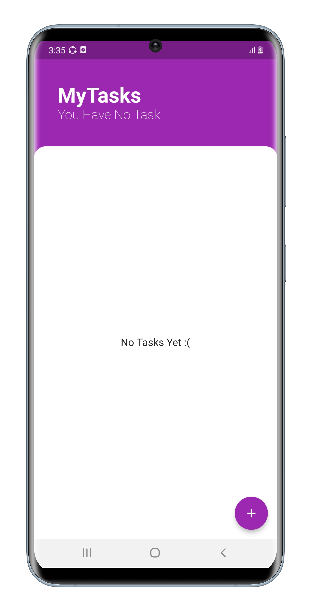
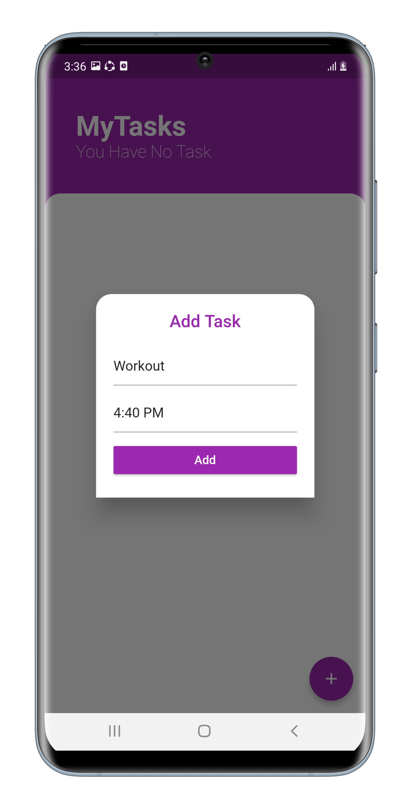
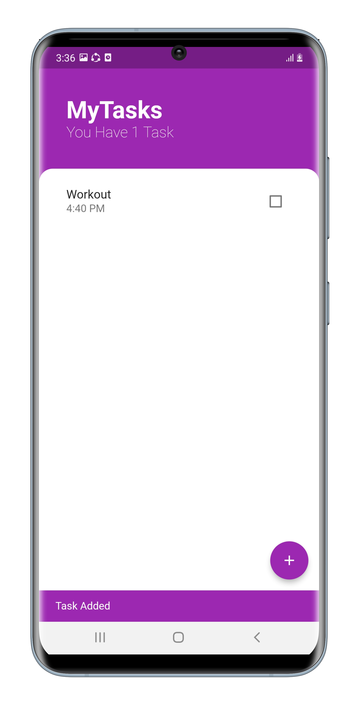
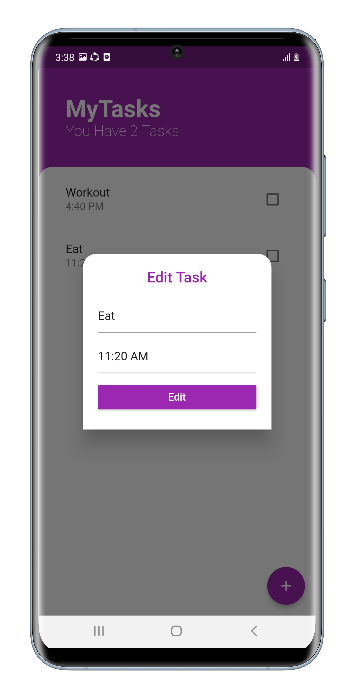
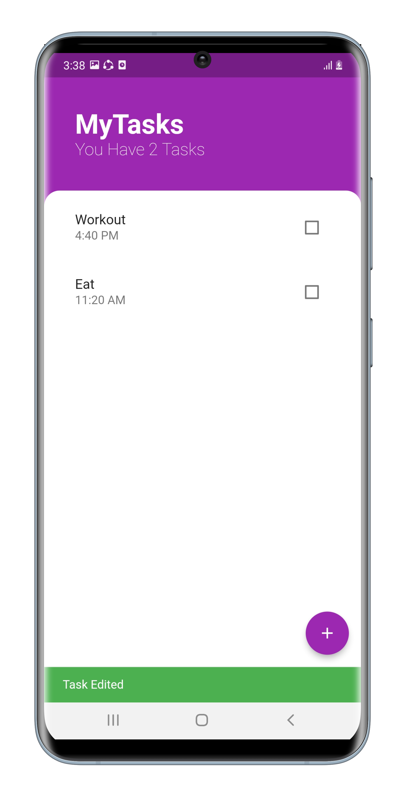
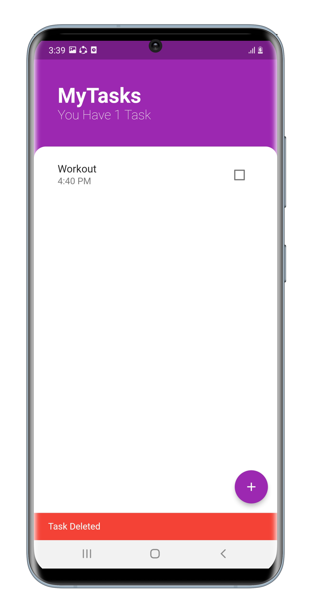
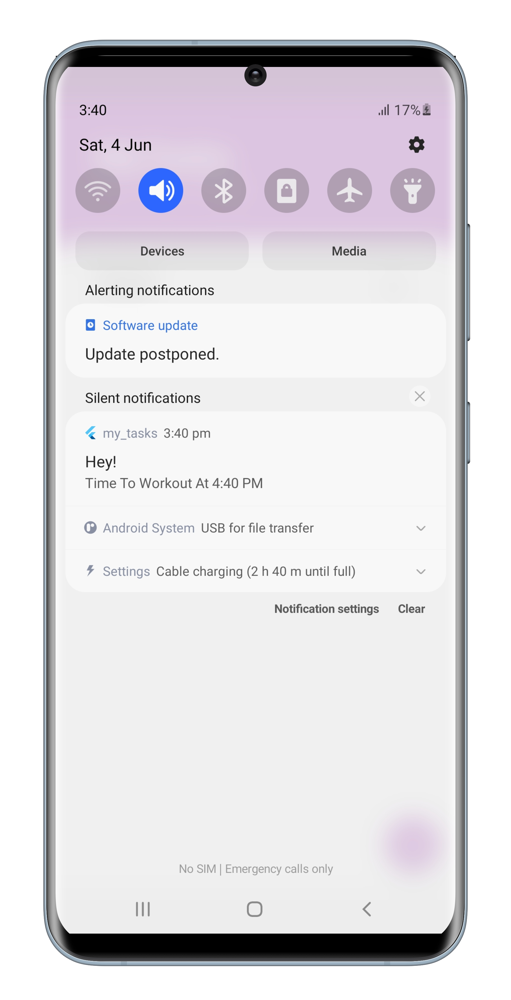
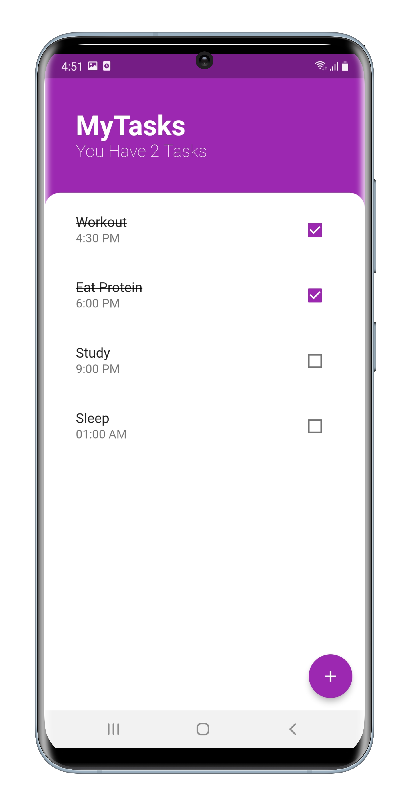

# MyTasks (ToDo App)

MyTasks is implemented by SQFLite, which is a package that helps to write SQL code in Flutter to persist data, and a local notifications package that helps to deliver local notifications to the user's device. The project is implemented with clean architecture (MVVM) and BLoC as state management.

## Project Motivation

I wanted to make this project to learn more about state management, clean code, data persistance like sqflite with CRUD operations and local notifications. So i decided to build a simple app to learn everything on it.

## Technologies Used

- Dart
- Flutter
- BLoC
- SQFLite
- Local Notifications

 

  
Project Screenshots

  
  
  
  
  
  
  
  
